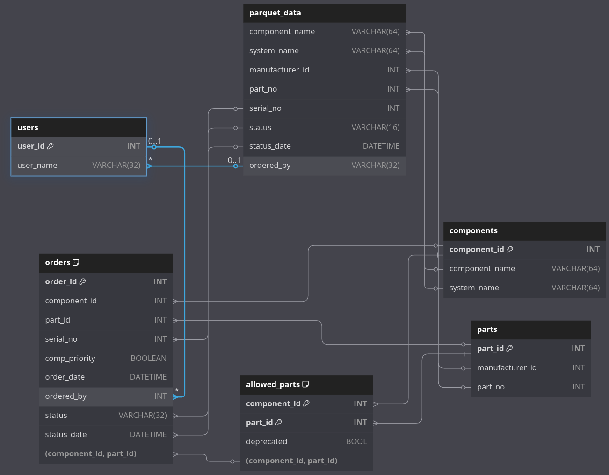

# Defense Unicorns - Data Engineering Practical

## Overview

This exercise is designed to assess a data engineering candidate’s ability to manipulate data programmatically, analyze insights, and demonstrate their thought process in designing data systems. Candidates should complete the assessment within a four-hour time limit for code submission.

Please note that this exercise is solely for evaluation purposes and will not be used in real-world applications by Defense Unicorns.

### Domain Overview

This exercise involves building a system to track parts orders for truck components. The company, which manufactures trucks, previously relied on a legacy ordering system that was lost due to poor disaster planning. The only remaining data is in the /data folder as extracts.

A DBA has designed a new PostgreSQL schema to store the recovered legacy data and track new orders. The system processes priority orders via a message queue and regular orders through nightly batch processing.

Your task is to write scripts to clean and ingest the legacy data, simulating both batch and stream processing. You should spend no more than four hours on the coding portion. Be prepared to discuss your approach during the assessment, but you do not need to submit written answers to the questions.

### Task
<!-- TODO: maybe remove or make more vague grading criteria for users -->
What is required to "pass" this assessment is to successfully populate the `components`, `parts`, `allowed_parts`, `users`, and `orders` tables from the legacy data.  Specific criteria that will be tested:
* pass/fail:
   * orders table number of rows = sum of unique `uuids` in legacy data dumps
* assessment rubric (in order of weight):
   * correct `ordered_by` and `ordered_date` in `orders` table
   * correct `status` and `status_date` in `orders` table
   * correct number of components and parts
   * only valid entries in `components.system_name` and `orders.status`
   * correct number `deprecated` entries in `allowed_parts`
   * correct number of orders with `comp_priority` flag set
   * complexity / quality of ingestion scripts / db communications

### Questions
<!-- TODO: remove sample answers -->
Be prepared to answer the following questions:
* What are two important pieces of information lost in the current schema
   * Good answer: `order_uuid` from the supplier and the full history of status changes
* How would you modify the schema if you wanted to include that information
   * Good answer: make a separate orders table and order_history table, add `order_uuid` to orders table
* If you needed to build a REST API to serve data about Orders, what main endpoint would you use and how would you design it (query params, http method(s) etc).
   * Many ways to do this, just looking to see if they are thinking about filtering orders by system etc.
* If you could design the storage from scratch, what would you change?
   * Many things could change, should probably at least wonder about the implementation of the `allowed_parts` table and connections -- foreign keys could be replaced by an on insert trigger, for example.

## Data diagram



## Data descriptions - Postgres schema

The following are the descriptions of the fields in the new postgres schema.  Keep in mind the legacy data may or may not meet these descriptions / types, or could have nonstandard formatting (names may appear in multiple places with different capitalization, for example).  The schema can be seen in `postgres/schema.sql`

### Comoponent

A component is a part that can be used for business purposes (install in a truck).  Fields:
* `component_id`: database assigned integer primary key
* `component_name`: VARCHAR(64) name of component
* `system_name`: VARCHAR(64) name of system (valid names are `HYDRAULIC`, `ELECTRICAL`, `TRANSMISSION`, `NAVIGATION`)

### Part

A part is something that can be ordered, like a bolt or a chassis.  Parts are generalized to a manufacturer and part number, not specified to a serial number (physical instance of a part).  The fields are:
* `part_id`: database assigned integer primary key
* `manufacturer_id`: integer id for a manufacturer
* `part_no`: Manufacturer's part number for the specific part
The `manufacturer_id` and `part_no` tuples must be unique

### Allowed Parts

When ordering parts against components, it is important that the parts are allowed to be ordered against that component.  Unfortunately, only the current allowed parts list survived the disaster so the deprecated parts parings must be inferred from the orders.  Allowed parts mappings:
* `component_id`: References components table
* `part_id`: References parts table
* `deprecated`: Whether this component / part pairing is currently in the allowed parts list
`component_id` and `primary_key` tuples must be unique (and serve as the primary key)

### Users

This is a simple lookup table to hold user information.  Fields:
* `user_id`: database assigned integer primary key
* `user_name`: VARCHAR(32) format should be `first_name.last_name`

### Orders

This is the main table to track orders.  It has the following fields:
* `order_id`: database assigned integer primary key
* `component_id`: References components table
* `part_id`: References parts table
* `serial_no`: Integer serial number of part ordered
* `comp_priority`: Boolean, set to true if this is a priority order
* `order_date`: Datetime the date status was set to `ORDERED`
* `ordered_by`: References `users.user_id` that submitted the order
* `status`: VARCHAR(16), current order status. valid entries are `PENDING`, `ORDERED`, `SHIPPED`, and `RECEIVED`
* `status_date`: Datetime the `status` field was set or updated
* an `order_id` is uniquely defined by the combination of `comopnent_id`, `part_id`, `serial_no`, and `order_date`.
* The `component_id`, `part_id` pairing must exist in the `allowed_parts` table

## Data descriptions - Data dumps

### Allowed parts list
Current allowed parts list has the following format / aggregation challenges and can be found in the `data/allowed_parts.csv`

* `component_name`: string lower case name of component with underscores
* `manufacturer_id`: integer manufacturer id
* `part_no`: integer part number

### Batch Order Data
The batch processing dump is in the `data/batch_orders.parquet` file and the streaming dump is in the `data/streaming_orders.json`.  Both have the following general fields, as well as the type of cleaning needed to be completed
* `order_uuid`: UUID the shipping system uses to keep track of orders
* `component_name`: name of the component (multiple cases, spaces may be `_` characters)
* `system_name`: name of the system (no cleaning required)
* `manufacturer_id`: integer id of the manufactuer (no cleaning required)
* `part_no`: integer part number (no cleaning required)
* `serial_no`: integer serial number (no cleaning required)
* `status`: status of order (no cleaning required)
* `status_date`: datetime of update
* `ordered_by`: Name of user who ordered part (only shows in `PENDING` rows for parquet or `ORDERED` messages for the streaming format, different name formats)

### Priority (streaming) Order Data
The streaming data json has the following schema:
```json
{
   "order_uuid" : "string",
   "datetime" : "string, fmt: MM-DD-YYYY HH:MM:SS",
   "status": "string",
   "details":
   {
      "component_name": "string",
      "system_name": "string",
      "manufacturer_id": "int",
      "part_number": "int",
      "serial_number": "int",
      "ordered_by": "string"
   }
}
```
The `details` field is optional and is only included on `ORDERED` status messages.

### Cleaning required
* Transform the component names into `lowercase_with_underscore_spaces` format
* Transform the user names into `first_name.last_name` format
* Ensure there is a valid entry in the `allowed_parts` table prior to attempting to insert an order
* The `ordered_by` data may have been corrupted in a small number of rows in the batch process orders.

<!-- TODO: Remove section after assessment is finalized -->
## ETL gotchas
Aside from the cleaning required in the individual fields mentioned in the Data descriptions, the following is also being tested:
* Most recent status: Legacy data will have to be aggregated and different fields picked from different staus updates.  Only the most recent status should be put into the database, but the user information will have to be picked from either the `PENDING` or `ORDERED` row.
* Duplicate data:  Rarely, an order will have a duplicate entry for the most recent status.  Sometimes, this may contain a different `ordered_by` user to test duplicate data handling.
* Component names in the raw data can be in many different formats either using spaces or underscores between words, sometimes capitalized and sometimes not.  They are consistent in a single `order_uuid`
* User names can be in `First Last`, `Last, First`, or `first.last` formats in the raw data
